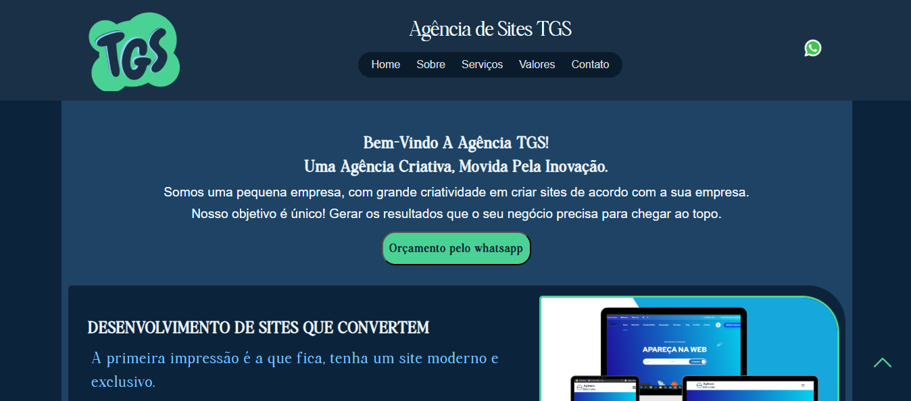

# Novo projeto

- Site: Agencia TGS

</img>

Projeto feito para mostrar o meu trabalho de Free-lancer

O site Lary TGS, foi criado para exibir o portfólio e os serviços de uma iniciativa profissional, com foco em apresentar projetos de forma clara e acessível. A plataforma busca oferecer uma experiência fluida e informativa para os visitantes.

Tecnologias Empregadas:

- HTML5: Organização do conteúdo com estrutura semântica e acessível.
- CSS3: Estilização visual, garantindo um design adaptável a diferentes telas.
- JavaScript: Adição de elementos interativos, como animações e funcionalidades dinâmicas.
- Hospedagem Web: Utilização de serviço de hospedagem para publicação e disponibilidade online.

Objetivos da Plataforma:

- Divulgar projetos e serviços oferecidos de maneira profissional.
- Simplificar o acesso a informações de contato e portfólio.
- Proporcionar uma navegação intuitiva e visualmente atraente.

Características Principais:

- Layout Responsivo: Compatível com dispositivos móveis, tablets e desktops.
- Navegação Simplificada: Interface amigável para acesso rápido ao conteúdo.
- Foco no Usuário: Design centrado em clareza e facilidade de interação.
